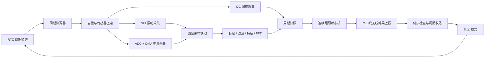

# 任务与数据流

本文档是首版固件总体架构、模块职责和运行契约的设计入口。具体板卡、传感器、引脚和电气参数以 [`hardware/硬件基线.md`](../hardware/硬件基线.md) 为准。

## 1. 架构目标

- 传感器驱动与算法解耦，更换 SPI/I2C 器件时不改告警策略。
- 中断只搬运最少状态，FFT、日志和上报全部在任务上下文执行。
- 采样缓冲使用固定容量，禁止动态增长和未定义的数据所有权。
- 以一次 RTC 唤醒周期为事务边界，所有结果都能关联到唯一 `cycle_id`。
- 只有健康监测确认关键任务正常，且本周期数据已处理或明确丢弃后，才允许喂狗和进入 Stop。

## 2. 分层架构

| 层级 | 主要模块 | 职责 | 不应承担的职责 |
| --- | --- | --- | --- |
| 应用与策略层 | `cycle_manager`、`alert_policy` | 周期状态机、连续超限、降级策略 | 直接访问寄存器或在中断中运行 |
| 信号处理层 | `filter`、`feature_extractor`、`fft_analyzer` | 标定、滤波、RMS、峰峰值、峰值因子、频带能量 | 控制传感器供电或发送串口 |
| 采集服务层 | `vibration_acq`、`temperature_acq`、`current_acq` | 建立统一采样窗口、时间戳、序号和有效标志 | 决定告警或进入低功耗 |
| 设备驱动层 | SPI 加速度计、I2C 温度、ADC DMA、RTC、UART | 器件初始化、收发、超时、错误恢复 | 执行业务阈值判断 |
| 平台服务层 | FreeRTOS、日志、看门狗、配置、错误统计 | 调度、诊断、参数快照和故障记录 | 隐式改变应用状态 |
| BSP/HAL 层 | STM32CubeMX 生成代码、CMSIS、HAL/LL | 时钟、引脚、中断和芯片外设适配 | 放置可移植业务算法 |

依赖方向只能从上层指向下层抽象。算法通过采样块和标定参数工作，不读取 HAL 句柄；驱动通过回调或队列提交数据，不调用告警模块。

## 3. 运行主链路

当前固件同时保留 USART1 结构化日志和 NRF24L01 无线上报适配；两条链路由独立配置控制，通信异常不会阻塞采集、处理和告警闭环。NRF24L01 的实际通信仍需要外接模块和接收端验证。

## 4. 周期状态机

| 状态 | 动作 | 正常退出条件 | 异常处理 |
| --- | --- | --- | --- |
| `BOOT` | 初始化时钟、RTOS、配置和诊断 | 基础初始化完成 | 记录错误并受控复位或停留故障态 |
| `SELF_TEST` | 检查传感器 ID、配置版本和上次复位原因 | 关键通道可用或允许降级 | 标记通道无效，不伪造采样值 |
| `IDLE` | 等待首次启动或 RTC 事件 | 收到合法唤醒事件 | 非预期唤醒计数 |
| `ACQUIRE` | 启动 SPI/FIFO、I2C 快照和 ADC DMA 窗口 | 必需数据块齐备 | 超时后终止通道并产生无效标志 |
| `PROCESS` | 标定、滤波、特征和 FFT | 结果对象生成 | 数值异常或饱和进入降级结果 |
| `EVALUATE` | 更新连续超限计数和告警状态 | 判定完成 | 配置无效时禁止产生有效告警 |
| `REPORT` | 输出周期结果与诊断统计 | 成功或达到单次截止时间 | 记录失败，不无限重试阻止休眠 |
| `PREPARE_STOP` | 排空队列、关闭传感器、保存必要状态 | 满足低功耗门禁 | 门禁失败则保持运行并报告原因 |
| `STOP` | 芯片低功耗等待 | RTC 或允许的外部中断唤醒 | 记录实际唤醒源 |
| `FAULT` | 保留最小诊断能力 | 人工复位或受控复位 | 不继续输出虚假正常数据 |

每次从 `IDLE/STOP` 进入采集都生成新的 `cycle_id`。状态迁移由 `cycle_manager` 统一完成，驱动和算法只能发布事件，不能直接切换系统状态。

## 5. FreeRTOS 任务与中断模型

| 执行单元 | 建议优先级 | 输入 | 输出 | 约束 |
| --- | ---: | --- | --- | --- |
| ADC DMA / 传感器中断 | 中断优先级按 FreeRTOS 规则配置 | 外设标志 | 缓冲索引、任务通知 | 不做浮点、FFT、日志格式化或阻塞 I/O |
| `acquisition_task` | 高 | 周期开始、DMA/FIFO 事件 | 完整采样块或明确错误 | 不等待上报完成 |
| `processing_task` | 中高 | 采样块索引 | 特征结果、有效标志 | 使用 CMSIS-DSP；处理完归还缓冲 |
| `cycle_task` | 中 | 周期事件、特征、超时 | 状态迁移、告警结果 | 唯一的应用状态拥有者 |
| `report_task` | 中低 | 周期结果 | UART/无线结果、发送统计 | 有超时和有界重试 |
| `health_task` | 低 | 心跳、栈水位、错误计数 | 看门狗许可、诊断快照 | 不由单个任务无条件喂狗 |

本项目 MCU 已改为 STM32F103ZET6，片上资源为 512 KB Flash、64 KB SRAM且无硬件 FPU。增加的 SRAM 为采样缓冲和任务栈提供了余量，但具体优先级数值、任务栈、队列深度和窗口工作区仍必须通过链接映射与运行统计确定，当前不预设伪精确数值。任务间优先使用直接任务通知、静态队列和固定块池；首版禁止在高频链路中反复 `malloc/free`。

1024 点 Q15 窗口、DMA 双缓冲、CMSIS-DSP 临时区、FreeRTOS 任务栈和日志缓冲必须放在同一份 SRAM 预算中检查；若 M1/M4 证明内存不足，应优先缩短窗口、减少并发缓冲或移除非必要日志，而不是隐藏溢出。

## 6. 数据对象与所有权

### 6.1 采样块

统一采样块至少包含：

| 字段 | 含义 |
| --- | --- |
| `cycle_id` | 本次唤醒周期标识 |
| `sequence` | 通道内递增块序号，用于检查丢块 |
| `channel` | `vibration_x/y/z` 或 `current` |
| `sample_rate_hz` | 本块实际采样率 |
| `sample_count` | 有效样本数 |
| `timestamp_ticks` | 单调时钟下的首样本时间 |
| `scale`、`offset` | 原始量到物理量的标定参数 |
| `flags` | 超时、溢出、饱和、丢块等有效性标志 |
| `data` | 固定长度样本数组或块池索引 |

驱动从块池取得空块并填写；采集任务把所有权交给处理队列；处理任务完成后归还块池。队列只传索引或指针，不复制大数组。块池耗尽时记录丢弃，不覆盖仍被处理的数据。

### 6.2 周期结果

周期结果至少包含 `cycle_id`、配置版本、各通道有效标志、温度、振动 RMS/峰峰值/峰值因子/频带能量、电流特征、告警状态、连续超限计数、采集与处理耗时以及错误位图。

结果中必须区分“数值为零”和“通道无效”。传感器断开、采集超时或算法溢出时，通过有效标志和错误码表达，不得填零冒充正常值。

## 7. 算法边界

- 振动通道负责去直流、窗函数、RMS、峰峰值、峰值因子和 FFT 频带能量。
- 温度首版按周期读取标量，可做限幅和简单趋势，不做 FFT。
- 电流通道先完成 ADC 原始值、零点和比例标定，再计算 RMS 或均值；具体算法取决于直流/交流前端，不在硬件未定时假设。
- Q15 FFT 必须与 Python 浮点参考对照，记录缩放、窗增益、饱和次数和误差容限。
- 阈值只能作用于单位明确且有效的物理量。未经标定的 ADC 码值不能直接作为可迁移告警阈值。

## 8. 告警状态机

每个告警项维护独立状态：`NORMAL -> PENDING -> ACTIVE -> RECOVERING -> NORMAL`。

- 连续 `N` 个有效周期超限后，由 `PENDING` 进入 `ACTIVE`。
- 任何无效周期都记录诊断，但默认不计为正常，也不自动清除告警。
- 恢复阈值应与触发阈值分离形成迟滞；连续 `M` 个有效周期低于恢复阈值后清除。
- 配置样例中的恢复阈值和 `recovery_windows` 是首版迟滞策略的占位契约；实际数值必须在安全演示对象上完成标定后再冻结。

## 9. 配置管理

[`config/thresholds.example.json`](../config/thresholds.example.json) 是参数含义和 PC 对照的样例，不要求资源受限 MCU 在首版运行时解析 JSON。固件侧可映射为版本化 `monitor_config_t`，并在启动和每次结果中输出配置版本与关键参数。

配置加载必须完成以下检查：

- 采样点数为所选 FFT 实现支持的长度，且采样率覆盖目标频带。
- 频带上下限满足 `0 <= low < high < sample_rate_hz / 2`。
- 阈值单位与传感器标定单位一致。
- 周期大于一次最坏采集、处理和上报总时长。
- 连续确认次数大于零，所有队列和缓冲容量固定且可解释。

## 10. 低功耗协调

进入 Stop 前必须同时满足：

1. DMA 和传感器采集已经停止，外设中断标志已清理。
2. 采样块已处理或以错误原因明确丢弃，块池无悬空所有权。
3. 上报成功或达到本周期截止时间，禁止无限重试。
4. 保留状态已写入合适的 RAM/备份域，RTC 唤醒源已配置。
5. 日志发送完成或允许丢弃低优先级日志。
6. 看门狗策略、系统时钟和外设在唤醒后的恢复顺序已经验证。

低功耗目标必须用仪器测量整周期平均电流和各状态驻留时间，不能仅引用芯片数据手册的典型 Stop 电流。

## 11. 错误与恢复原则

- I2C/SPI 超时有次数上限；先复位总线或器件，再把失败交给周期状态机。
- DMA 溢出、块池耗尽和序号断裂必须计数，并使相关特征无效。
- 单个非关键传感器可按已定义策略降级；关键通道不可用时本周期不输出“正常”。
- 上报失败不应阻塞下一次休眠，但要保留累计计数并在后续结果中带出。
- 看门狗只处理软件失控，不代替业务超时和总线恢复。
- 重启后记录复位原因、上个周期状态和配置版本，便于区分上电、看门狗和软件复位。

## 12. 计划中的固件落点

| 路径 | 职责 |
| --- | --- |
| `Core/App/` | 周期状态机、任务创建、告警策略 |
| `Core/Acquisition/` | 三类采集服务、采样块和块池 |
| `Core/Algorithm/` | 标定、滤波、特征、FFT |
| `Core/Drivers/` | 传感器及板级外设适配 |
| `Core/Platform/` | 配置、日志、时间、错误码和看门狗 |
| `Core/Telemetry/` | UART 或无线结果编码与发送 |
| `AppTests/` | 可脱离硬件运行的算法和状态机测试 |

这只是职责规划。首次创建文件时只加入当前里程碑所需内容，不提前堆放空实现或把 CubeMX 生成目录改造成不可再生成结构。
